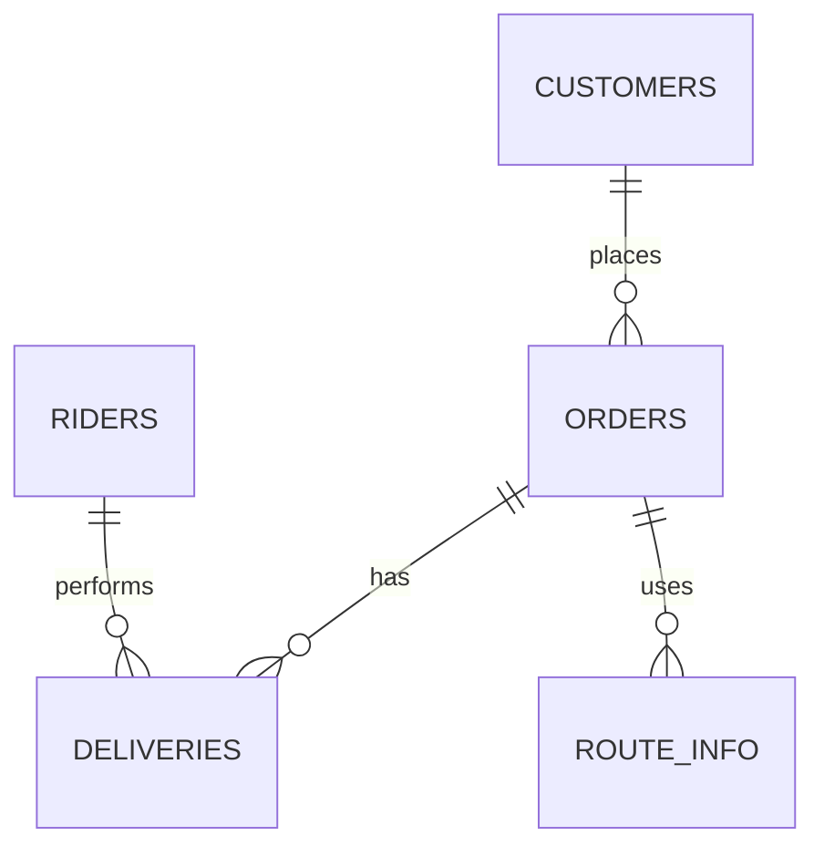

# Logistics-Delivery-Tracking-System-SQL-Project
A complete SQL-based project modelling a last-mile delivery platform. Includes full database schema, 1000+ sample rows, ER diagram, analytics queries, and project documentation.

## Project Overview
This project simulates operations of a logistics & delivery system.
It enables analysis of:
- On-time delivery rate
- Rider efficiency
- Traffic delays
- Customer order habits
- Impossible/fraudulent deliveries

## Tech Stack
- SQL (MySQL/PostgreSQL)
- ER Diagrams (Mermaid)
- Python for data generation
- LaTeX for PDF report

## Database Tables
- Customers
- Riders
- Orders
- Deliveries
- Route_Info

## ER Diagram (Mermaid)


## Key Analytics Queries
### On-Time Delivery Rate Per Rider
```sql
SELECT r.rider_id, r.name, COUNT(*) AS total_deliveries,
SUM(CASE WHEN d.delivery_status = 'ON_TIME' THEN 1 ELSE 0 END) AS on_time_deliveries,
ROUND(100.0 * SUM(CASE WHEN d.delivery_status = 'ON_TIME' THEN 1 ELSE 0 END) / COUNT(*), 2)
AS on_time_rate_pct
FROM Deliveries d
JOIN Riders r ON d.rider_id = r.rider_id
GROUP BY r.rider_id, r.name
ORDER BY on_time_rate_pct DESC;
